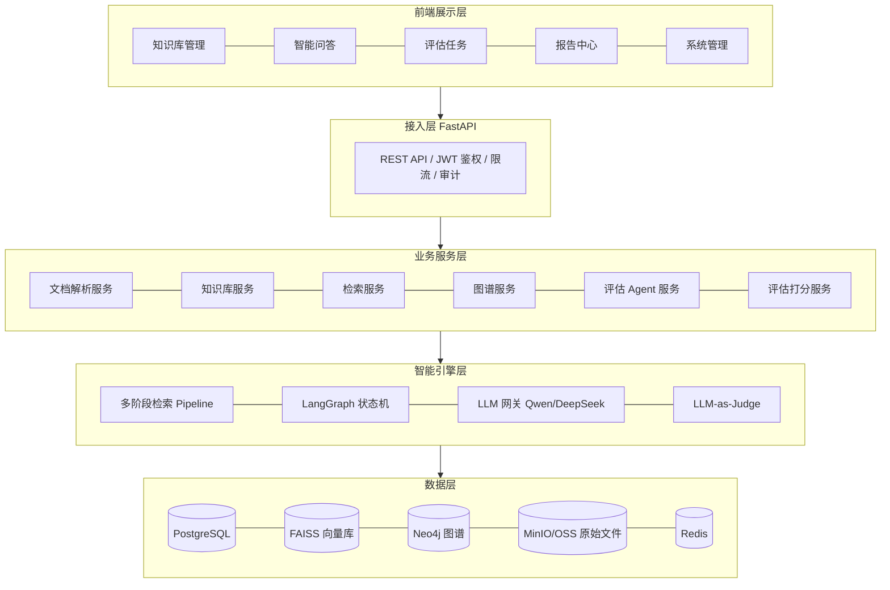
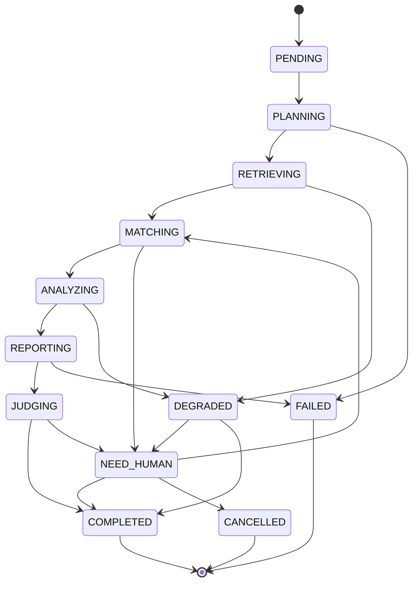
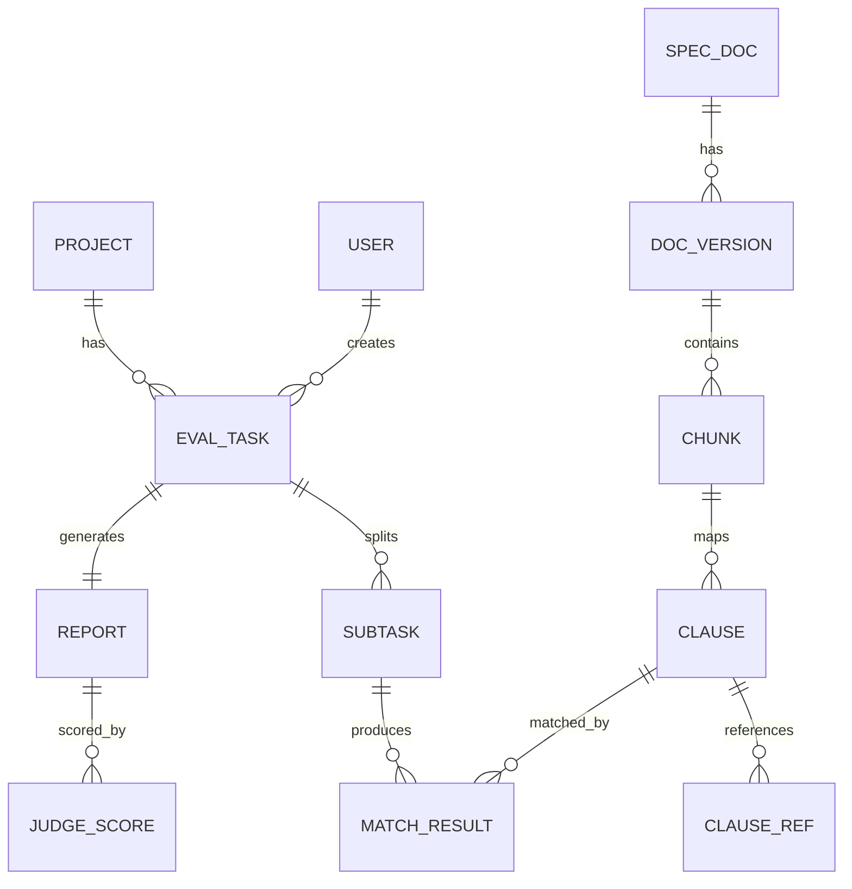

# 工程监理质量智能评估系统 — 软件需求规格说明书（SRS）

> **文档说明**
> 本文件是需求规格说明书的**唯一维护版本**，位于项目内 `docs/` 目录。
> 原先放在工作区根目录 `D:\Docment\` 下的同名文件已删除，请勿再于该位置创建副本，以免出现两份内容分叉。
> 需求变更直接修改本文件；代码与文档中的 `FR-xxx` / `NFR-xxx` 编号均以此为准。


| 项目 | 内容 |
| --- | --- |
| 文档名称 | 工程监理质量智能评估系统 软件需求规格说明书 |
| 文档版本 | V1.0 |
| 项目周期 | 2026.01 – 2026.08 |
| 文档状态 | 已评审 / 基线 |
| 技术栈 | LangChain / LangGraph / Qwen / DeepSeek / FAISS / Neo4j / PostgreSQL / FastAPI / Vue3 / TypeScript / Docker |

**修订记录**

| 版本 | 日期 | 修订内容 | 作者 |
| --- | --- | --- | --- |
| V0.1 | 2026-01 | 初稿：业务背景、范围、干系人 | 项目组 |
| V0.5 | 2026-02 | 补充 RAG 检索、知识图谱、Agent 需求 | 项目组 |
| V1.0 | 2026-03 | 补充评估体系、接口规格、验收标准，形成基线 | 项目组 |

---

## 1. 引言

### 1.1 编写目的

本文档定义「工程监理质量智能评估系统」的功能需求、接口需求、数据需求与非功能需求，作为开发、测试、验收的统一依据。预期读者：产品经理、后端/前端/AI 工程师、测试工程师、监理业务专家、运维人员。

### 1.2 项目背景

工程监理工作中，质量评估需大量依据国家标准、行业规范、地方规程与企业内部细则。当前存在四类痛点：

| 编号 | 痛点 | 具体表现 | 业务影响 |
| --- | --- | --- | --- |
| P1 | 规范文档数量多、分散 | 单个项目涉及规范数百份，PDF/Word 混存，版本不一致 | 查阅耗时长，易引旧版 |
| P2 | 人工查询效率低 | 关键词全文检索无法理解语义，命中率低 | 单次核查 30–60 分钟 |
| P3 | 评估依赖专家经验 | 结论因人而异，缺少统一口径与留痕 | 评估结果不可复现、难追溯 |
| P4 | 引用链断裂 | 条款之间的引用、上位法关系靠人脑记忆 | 依据不充分，责任风险高 |

本项目建设企业级知识库智能检索与质量评估平台，实现**规范知识管理 → 智能问答 → 标准匹配 → 自动化质量评估**的闭环。

### 1.3 建设目标

| 目标 | 度量指标 | 目标值 |
| --- | --- | --- |
| G1 规范知识资产化 | 规范文档入库覆盖率 | ≥ 95% 现行有效规范 |
| G2 检索智能化 | 复杂问题 Top-5 召回率 / 答案忠实度 | 召回率 ≥ 90%，忠实度 ≥ 85% |
| G3 评估自动化 | 评估报告自动生成率、专家采纳率 | ≥ 80% 自动生成，采纳率 ≥ 85% |
| G4 过程可追溯 | 评估结论可回溯至条款级引用的比例 | 100% |
| G5 效率提升 | 单次质量评估耗时 | 由 30–60 分钟降至 ≤ 5 分钟 |

### 1.4 术语与缩略语

| 术语 | 说明 |
| --- | --- |
| RAG | Retrieval-Augmented Generation，检索增强生成 |
| Chunk | 文档切分后的最小检索单元 |
| Hybrid Search | 稀疏检索（BM25）与稠密检索（向量）的混合检索 |
| RRF | Reciprocal Rank Fusion，倒数排名融合算法 |
| Reranker | 重排序模型（本项目为 BGE-Reranker） |
| Multi-Query | 将原问题改写为多个子查询并行检索 |
| KG | Knowledge Graph，知识图谱 |
| LLM-as-Judge | 用大模型对生成结果进行自动化质量评分 |
| Agent | 具备规划与工具调用能力的智能体 |
| 条款 | 规范中的编号条目（如 5.2.3），是评估的最小依据单元 |

### 1.5 需求优先级定义

- **P0（必须）**：缺失则系统不可用，本期必交付。
- **P1（重要）**：显著影响可用性，本期交付。
- **P2（增强）**：体验优化，资源允许时交付。

---

## 2. 总体描述

### 2.1 产品定位

面向监理企业、项目监理部与质量监督机构的**私有化部署平台**，支持多项目、多角色协同。系统不替代监理工程师的最终签字责任，定位为「依据检索 + 初评建议 + 过程留痕」的辅助决策工具。

### 2.2 用户角色与权限

| 角色 | 职责 | 核心权限 |
| --- | --- | --- |
| 系统管理员 | 用户、角色、系统配置 | 全部管理权限、模型与检索参数配置 |
| 知识库管理员 | 规范文档全生命周期管理 | 上传、解析、审核、发布、下线、版本管理 |
| 监理工程师 | 日常查询与评估发起 | 智能问答、发起评估、查看本人任务 |
| 质量评估专家 | 复核与裁定 | 复核评估结论、修订评分、终审签发 |
| 只读访客 | 查阅 | 仅查看已发布知识与报告 |

### 2.3 运行环境

| 层级 | 组件 | 版本要求 |
| --- | --- | --- |
| 运行时 | Python / Node.js | 3.11+ / 20 LTS |
| Web 框架 | FastAPI + Uvicorn/Gunicorn | FastAPI ≥ 0.110 |
| 编排 | LangChain / LangGraph | LangChain ≥ 0.2，LangGraph ≥ 0.1 |
| 大模型 | Qwen（本地/私有化）、DeepSeek（云端备选） | 通过统一 LLM 网关适配 |
| Embedding | BGE-M3 / bge-large-zh | 支持 ONNX / GPU 推理 |
| Reranker | BGE-Reranker-v2-m3（或 large） | 支持批处理与 Top-K 截断 |
| 向量库 | FAISS | IndexFlatIP / IVF-Flat，GPU 可选 |
| 图数据库 | Neo4j | 5.x（含 APOC） |
| 关系库 | PostgreSQL | 15+（启用 pg_trgm、JSONB） |
| 缓存/队列 | Redis | 7.x（任务队列、会话与限流） |
| 前端 | Vue3 + TypeScript + Vite + Pinia + Element Plus | Vue 3.4+ |
| 部署 | Docker + Docker Compose | Compose v2 |
| 可观测 | Prometheus + Grafana + Loki | 指标、日志、链路追踪 |

### 2.4 系统总体架构



### 2.5 业务主流程

1. 知识库管理员上传规范 → 解析清洗 → 切分 → 向量化 → 入库审核 → 发布。
2. LLM 抽取规范实体与关系 → 写入 Neo4j → 构建条款引用链。
3. 监理工程师提交待评内容（检查记录/验收资料/问题描述）+ 评估标准。
4. LangGraph Agent 执行：任务拆解 → 规范检索 → 条款匹配 → 结果分析 → 报告生成。
5. LLM-as-Judge 对评估结果打分，低于阈值转人工复核。
6. 专家复核签发 → 报告归档 → 全链路留痕。

### 2.6 设计约束

- **C1 私有化**：核心数据不出企业内网，模型支持本地部署与云端可切换。
- **C2 可解释**：任何结论必须给出条款级引用与原文出处（文件、页码、条款号）。
- **C3 不臆造**：无依据时必须回答「未检索到相关规范」，禁止模型自由发挥。
- **C4 幂等与可重放**：同一评估任务重复执行结果可复现（固定随机种子、参数版本化）。
- **C5 兼容性**：Chrome/Edge 100+；支持 1366×768 及以上分辨率。

### 2.7 假设与依赖

| 编号 | 假设/依赖 | 风险与应对 |
| --- | --- | --- |
| A1 | 规范文档具备可复制文本层 | 扫描件占比高时启用 OCR（PaddleOCR）降级链路 |
| A2 | GPU 资源满足 Embedding/Rerank 推理 | 不足时降级 CPU 或使用云端 Embedding |
| A3 | Qwen 私有化服务稳定可用 | 配置 DeepSeek 作为故障转移 |
| A4 | 业务专家参与标注与评分口径制定 | 前期投入 2 名专家参与规则共建 |

---

## 3. 功能需求

需求编号规则：`FR-模块-序号`。

### 3.1 模块一：知识库与文档管理（FR-KB）

| 编号 | 需求名称 | 需求描述 | 优先级 | 验收标准 |
| --- | --- | --- | --- | --- |
| FR-KB-01 | 文档上传 | 支持 PDF、Word（doc/docx）、TXT、Excel 批量上传，单文件 ≤ 200MB，单批 ≤ 50 个 | P0 | 上传成功率 100%，失败有明确原因提示 |
| FR-KB-02 | 元数据录入 | 可录入规范名称、编号、发布单位、发布日期、实施日期、废止日期、专业分类、适用范围、地区级别 | P0 | 必填字段校验通过后入库 |
| FR-KB-03 | 文档解析 | PDF 按版面还原标题/段落/表格；Word 保留标题层级与编号；提取页码与章节路径 | P0 | 解析准确率 ≥ 95%（抽样 200 页人工核对） |
| FR-KB-04 | 文档清洗 | 去页眉页脚、去水印、去乱码、合并断行、修正全半角、保留条款编号 | P0 | 清洗后条款编号完整率 ≥ 99% |
| FR-KB-05 | 智能切分 | 按「章—节—条—款」层级递归切分，chunk 长度 300–800 token，重叠 10%–15%，超长表格单独成块 | P0 | 条款跨块截断率 < 2% |
| FR-KB-06 | 向量化入库 | 生成 Embedding 写入 FAISS，同步写入 PostgreSQL 元数据与 BM25 索引 | P0 | 10 万 chunk 全量构建 ≤ 60 分钟 |
| FR-KB-07 | 版本管理 | 支持规范多版本共存、版本对比、失效版本自动下线并保留历史引用 | P1 | 旧版本引用的历史报告仍可正常回溯 |
| FR-KB-08 | 审核发布 | 解析结果需人工审核确认后发布，未发布文档不参与检索 | P0 | 未发布文档检索命中数为 0 |
| FR-KB-09 | 失效与废止 | 规范废止后自动标记，检索时降权并提示「该规范已废止，现行版本为 X」 | P1 | 提示准确率 100% |
| FR-KB-10 | 增量更新 | 支持单文档增量重建索引，不影响其他文档可用性 | P1 | 增量更新期间检索服务可用率 100% |

### 3.2 模块二：RAG 智能检索（FR-RET）

| 编号 | 需求名称 | 需求描述 | 优先级 | 验收标准 |
| --- | --- | --- | --- | --- |
| FR-RET-01 | 多阶段检索 Pipeline | 实现「查询理解 → Multi-Query 改写 → 混合召回 → 融合 → 重排 → 上下文组装」全链路 | P0 | 单次检索端到端 P95 ≤ 3s |
| FR-RET-02 | 查询理解 | 识别问题意图（查条款/查要求/查判定标准/查流程），抽取专业实体与限定条件（专业、部位、等级） | P0 | 意图分类准确率 ≥ 90% |
| FR-RET-03 | Multi-Query 改写 | 由 LLM 生成 3–5 个语义等价或细化的子查询，支持口语化问题转规范术语 | P0 | 复杂问题召回增益 ≥ 15%（对比单查询） |
| FR-RET-04 | Hybrid Search | 并行执行 BM25 稀疏检索与 FAISS 稠密检索，各召回 Top-50 | P0 | 混合召回率 ≥ 单路召回的较大者 + 8% |
| FR-RET-05 | RRF 融合 | 使用 RRF（k=60）融合多路子查询与双通道结果，支持通道权重配置 | P0 | 融合后 Top-20 覆盖率 ≥ 95% |
| FR-RET-06 | Rerank 重排 | BGE-Reranker 对融合结果精排，输出 Top-N（默认 8）并给出相关性分数 | P0 | 重排后 Top-5 准确率 ≥ 90% |
| FR-RET-07 | 上下文组装 | 去重、按条款完整性补齐上下文、按相关性排序、控制总 token 预算 | P0 | 引用条款完整率 100% |
| FR-RET-08 | 检索参数配置 | 支持配置 chunk 大小、Top-K、RRF 权重、重排阈值等，支持按知识库维度独立配置 | P1 | 配置变更实时生效，可回滚 |
| FR-RET-09 | 引用溯源 | 每个答案片段附带文件、章节路径、条款号、页码、原文高亮 | P0 | 溯源准确率 100%，可一键跳转原文 |
| FR-RET-10 | 无依据兜底 | 重排最高分低于阈值时明确回复「未检索到相关规范」，并给出相近条款建议 | P0 | 不出现无引用结论 |
| FR-RET-11 | 多轮对话检索 | 支持追问，结合会话历史改写查询，支持指代消解 | P1 | 追问场景召回率下降 ≤ 5% |
| FR-RET-12 | 检索评估集 | 建设 ≥ 300 条标注问答对，支持离线回归评估（Recall@K、MRR、NDCG） | P1 | 每次发布自动产出评估报告 |

### 3.3 模块三：知识图谱增强（FR-KG）

| 编号 | 需求名称 | 需求描述 | 优先级 | 验收标准 |
| --- | --- | --- | --- | --- |
| FR-KG-01 | 实体抽取 | 抽取规范、章节、条款、专业术语、工程部位、材料、指标、单位、机构等实体 | P0 | 实体识别 F1 ≥ 0.85 |
| FR-KG-02 | 关系抽取 | 抽取「依据/引用/替代/细化/矛盾/适用于/包含」等关系 | P0 | 关系抽取 F1 ≥ 0.80 |
| FR-KG-03 | 图谱构建 | 实体与关系写入 Neo4j，建立条款唯一 ID 与原文块的双向映射 | P0 | 图谱节点与 PG 记录一致率 100% |
| FR-KG-04 | 引用链追踪 | 支持从任一 clause 出发，正向/反向追踪引用链，最大深度可配（默认 3） | P0 | 引用链查询 P95 ≤ 500ms |
| FR-KG-05 | 图谱增强检索 | 命中条款后自动扩展其上位依据、下位细化条款与替代条款，参与重排 | P1 | 引入图谱后召回率再提升 ≥ 5% |
| FR-KG-06 | 冲突检测 | 检测不同规范间对同一指标要求不一致的情况并提示 | P1 | 冲突识别召回率 ≥ 80% |
| FR-KG-07 | 图谱可视化 | 前端展示条款关系网络，支持展开、折叠、定位原文 | P1 | 1000 节点内渲染流畅（≥ 30fps） |
| FR-KG-08 | 人工校正 | 支持专家修正/删除错误实体与关系，形成反馈闭环 | P1 | 修正后 5 分钟内重建相关子图 |

### 3.4 模块四：合规评估 Agent（FR-AGT）

| 编号 | 需求名称 | 需求描述 | 优先级 | 验收标准 |
| --- | --- | --- | --- | --- |
| FR-AGT-01 | 评估任务创建 | 提交待评对象（工程部位、施工记录、检验批资料、问题描述）、专业、评估类型 | P0 | 表单校验完整，支持模板导入 |
| FR-AGT-02 | LangGraph 工作流 | 实现 5 阶段流程：任务拆解 → 规范检索 → 条款匹配 → 结果分析 → 报告生成 | P0 | 全流程可重放，节点级日志完整 |
| FR-AGT-03 | 任务拆解 | 将评估目标拆为可核查子任务清单，明确每项判定标准与所需证据 | P0 | 子任务覆盖率 ≥ 90%（专家评审） |
| FR-AGT-04 | 规范检索 | 对每个子任务调用混合检索，返回候选条款及分数 | P0 | 单任务检索 P95 ≤ 3s |
| FR-AGT-05 | 条款匹配 | 将证据与条款要求逐条比对，输出「符合/不符合/部分符合/不适用/证据不足」 | P0 | 与专家判定一致率 ≥ 85% |
| FR-AGT-06 | 结果分析 | 汇总不符合项，分析原因、风险等级与整改建议 | P0 | 整改建议可执行率 ≥ 80% |
| FR-AGT-07 | 报告生成 | 输出结构化报告：概述、依据清单、逐条比对表、问题清单、风险等级、整改建议、结论 | P0 | 格式合规率 ≥ 95%，支持导出 PDF/Word |
| FR-AGT-08 | 状态机与断点续跑 | 记录当前任务、已完成步骤、检索结果、异常状态；支持失败从最近检查点恢复 | P0 | 中断恢复后结果与未中断一致 |
| FR-AGT-09 | 防死循环 | 最大迭代次数（默认 12）、无进展检测（连续 2 轮无新增有效信息则终止）、工具调用超时（默认 30s）、重复调用去重 | P0 | 100 次压测中死循环发生 0 次，均能在上限内收敛 |
| FR-AGT-10 | 异常降级 | 检索失败/模型超时/JSON 解析失败时重试（指数退避，≤3 次）并降级为部分结论 + 人工介入标记 | P0 | 异常任务 100% 有明确状态与原因 |
| FR-AGT-11 | 人在回路 | 关键节点（条款匹配确认、报告签发）支持人工介入与修改后继续执行 | P1 | 人工修改可完整追溯 |
| FR-AGT-12 | 并发控制 | 支持多任务并发执行，单实例并发 ≥ 10，任务队列削峰 | P1 | 并发 10 时 P95 增幅 ≤ 50% |
| FR-AGT-13 | 执行可视化 | 前端实时展示 Agent 执行轨迹（当前节点、耗时、Token 消耗、中间产物） | P1 | 轨迹与日志一致率 100% |

### 3.5 模块五：LLM-as-Judge 质量评估（FR-JDG）

| 编号 | 需求名称 | 需求描述 | 优先级 | 验收标准 |
| --- | --- | --- | --- | --- |
| FR-JDG-01 | 评分维度 | 条款引用准确性、结论合理性、证据充分性、格式规范性、整改建议可执行性（各 0–5 分） | P0 | 维度定义经专家评审确认 |
| FR-JDG-02 | 加权总分 | 支持维度权重配置，输出总分与等级（优秀/良好/合格/不合格） | P0 | 权重可配置且变更留痕 |
| FR-JDG-03 | 引用校验 | 自动校验引用条款是否真实存在、是否与上下文语义一致、是否为现行版本 | P0 | 幻觉引用识别率 ≥ 95% |
| FR-JDG-04 | 双模型交叉评审 | Qwen 与 DeepSeek 分别评审，分歧超过阈值时标记待复核 | P1 | 分歧检出率 100% |
| FR-JDG-05 | 低分拦截 | 总分低于阈值（默认 3.5）自动转人工复核，不直接出具正式报告 | P0 | 低分报告 100% 进入复核队列 |
| FR-JDG-06 | 反馈闭环 | 专家复核结果回写为训练与提示词优化样本 | P1 | 样本自动归档，月度迭代 |
| FR-JDG-07 | 质量看板 | 展示平均分、各维度分布、低分原因 TOP10、模型对比趋势 | P1 | 数据延迟 ≤ 5 分钟 |

### 3.6 模块六：系统管理（FR-SYS）

| 编号 | 需求名称 | 需求描述 | 优先级 |
| --- | --- | --- | --- |
| FR-SYS-01 | 用户与角色 | 用户 CRUD、角色绑定、数据权限（按项目/专业隔离） | P0 |
| FR-SYS-02 | 认证授权 | JWT + Refresh Token，密码策略，登录失败锁定，支持企业 SSO（OIDC/LDAP） | P0 |
| FR-SYS-03 | 审计日志 | 记录登录、检索、上传、评估、导出、配置变更等操作，字段含操作人/IP/时间/对象/结果 | P0 |
| FR-SYS-04 | 模型配置 | 配置 LLM 端点、模型名、温度、超时、并发上限，支持多模型路由与故障转移 | P0 |
| FR-SYS-05 | 提示词管理 | 提示词模板版本化，支持灰度与回滚 | P1 |
| FR-SYS-06 | 监控告警 | 服务健康、QPS、延迟、错误率、Token 消耗监控与阈值告警 | P1 |
| FR-SYS-07 | 数据导出 | 评估报告、检索记录、知识清单导出（PDF/Word/Excel） | P1 |

---

## 4. Agent 状态机设计规格

### 4.1 状态定义

| 状态 | 说明 | 允许的下一状态 |
| --- | --- | --- |
| `PENDING` | 任务已创建待执行 | `PLANNING`、`CANCELLED` |
| `PLANNING` | 任务拆解中 | `RETRIEVING`、`FAILED` |
| `RETRIEVING` | 规范检索中 | `MATCHING`、`DEGRADED` |
| `MATCHING` | 条款匹配中 | `ANALYZING`、`NEED_HUMAN` |
| `ANALYZING` | 结果分析中 | `REPORTING`、`DEGRADED` |
| `REPORTING` | 报告生成中 | `JUDGING`、`FAILED` |
| `JUDGING` | 质量评审中 | `COMPLETED`、`NEED_HUMAN` |
| `NEED_HUMAN` | 等待人工介入 | `MATCHING`、`COMPLETED`、`CANCELLED` |
| `DEGRADED` | 降级完成（部分结论） | `NEED_HUMAN`、`COMPLETED` |
| `COMPLETED` | 正常完成 | 终态 |
| `FAILED` | 失败 | 终态（可重试新建） |
| `CANCELLED` | 取消 | 终态 |



### 4.2 状态字段

| 字段 | 类型 | 说明 |
| --- | --- | --- |
| `task_id` | UUID | 任务唯一标识 |
| `thread_id` | String | LangGraph 检查点会话 ID |
| `current_state` | Enum | 当前状态 |
| `current_step` | String | 当前执行节点 |
| `completed_steps` | Array | 已完成步骤及各步耗时、Token 用量 |
| `retrieval_results` | Object | 各子任务检索结果与分数 |
| `matched_clauses` | Array | 条款匹配结论 |
| `iteration_count` | Integer | 迭代次数（上限 12） |
| `no_progress_rounds` | Integer | 无进展轮次（阈值 2） |
| `error_state` | Object | 异常类型、信息、重试次数、堆栈摘要 |
| `checkpoints` | Array | 检查点列表，支持断点续跑 |

### 4.3 防死循环与收敛机制

| 机制 | 规则 | 触发动作 |
| --- | --- | --- |
| 最大迭代次数 | `iteration_count > 12` | 终止并置 `DEGRADED`，输出已有结论 |
| 无进展检测 | 连续 2 轮无新增有效条款/无分数提升 | 终止循环，转人工复核 |
| 工具调用超时 | 单次工具调用 > 30s | 中断该次调用并重试 |
| 重试上限 | 单步重试 ≤ 3 次（指数退避 1s/2s/4s） | 超限置 `FAILED` |
| 重复调用去重 | 相同工具+相同参数指纹重复 | 直接复用缓存结果，不计数迭代 |
| 总耗时上限 | 单任务 > 15 分钟 | 强制落检查点并转人工 |
| Token 预算 | 单任务 > 200K token | 触发压缩摘要或转人工 |

### 4.4 检查点与恢复

- 每个节点执行完成后写入 LangGraph Checkpointer（PostgreSQL 持久化）。
- 恢复时从最近成功检查点重建状态，已完成的检索结果从缓存复用，不重复调用模型。
- 恢复后 `iteration_count` 与 `no_progress_rounds` 沿用原值，不重置，避免绕过上限。

---

## 5. 数据需求

### 5.1 核心实体关系（逻辑模型）



### 5.2 关键表结构（PostgreSQL）

**spec_doc 规范文档主表**

| 字段 | 类型 | 约束 | 说明 |
| --- | --- | --- | --- |
| id | BIGSERIAL | PK | 主键 |
| spec_code | VARCHAR(64) | UNIQUE NOT NULL | 规范编号 |
| spec_name | VARCHAR(255) | NOT NULL | 规范名称 |
| issuer | VARCHAR(128) | | 发布单位 |
| publish_date | DATE | | 发布日期 |
| effective_date | DATE | | 实施日期 |
| abolish_date | DATE | | 废止日期 |
| specialty | VARCHAR(64) | | 专业分类 |
| region_level | VARCHAR(32) | | 国家/行业/地方/企业 |
| status | VARCHAR(16) | NOT NULL | draft/published/abolished |
| created_at / updated_at | TIMESTAMPTZ | NOT NULL | 时间戳 |

**doc_chunk 文本块表**

| 字段 | 类型 | 约束 | 说明 |
| --- | --- | --- | --- |
| id | BIGSERIAL | PK | 主键 |
| doc_version_id | BIGINT | FK | 所属文档版本 |
| clause_no | VARCHAR(64) | INDEX | 条款号 |
| chapter_path | VARCHAR(512) | | 章节路径 |
| page_no | INT | | 页码 |
| content | TEXT | NOT NULL | 原文 |
| token_count | INT | | token 数 |
| faiss_id | BIGINT | INDEX | 向量库 ID |
| embedding_model | VARCHAR(64) | | 向量模型版本 |
| status | VARCHAR(16) | | active/obsolete |

**eval_task 评估任务表**

| 字段 | 类型 | 说明 |
| --- | --- | --- |
| id | UUID PK | 任务 ID |
| project_id / user_id | BIGINT FK | 项目、发起人 |
| input_payload | JSONB | 待评对象与参数 |
| current_state | VARCHAR(24) | 状态机状态 |
| iteration_count / no_progress_rounds | INT | 收敛计数 |
| state_snapshot | JSONB | 状态机完整快照 |
| started_at / finished_at | TIMESTAMPTZ | 起止时间 |
| total_tokens / total_cost | INT / NUMERIC | 资源消耗 |

**match_result 条款匹配表**

| 字段 | 类型 | 说明 |
| --- | --- | --- |
| id | BIGSERIAL PK | 主键 |
| task_id / subtask_id | UUID / BIGSERIAL FK | 任务、子任务 |
| clause_id | BIGINT FK | 命中条款 |
| verdict | VARCHAR(16) | 符合/不符合/部分符合/不适用/证据不足 |
| confidence | NUMERIC(4,3) | 置信度 |
| relevance_score | NUMERIC(6,4) | 重排分数 |
| evidence | TEXT | 证据摘录 |
| reasoning | TEXT | 判定理由 |
| citation_json | JSONB | 引用溯源信息 |

**judge_score 评审评分表**

| 字段 | 类型 | 说明 |
| --- | --- | --- |
| id | BIGSERIAL PK | 主键 |
| report_id | UUID FK | 报告 ID |
| judge_model | VARCHAR(64) | 评审模型 |
| dimension | VARCHAR(32) | 评分维度 |
| score | NUMERIC(3,1) | 0–5 分 |
| weight | NUMERIC(4,3) | 权重 |
| comment | TEXT | 评审说明 |
| is_conflict | BOOLEAN | 是否双模型分歧 |

### 5.3 向量库（FAISS）

| 项 | 规格 |
| --- | --- |
| 索引类型 | IndexFlatIP（≤ 50 万向量）／ IVF-Flat（> 50 万，nlist=4096, nprobe=32） |
| 向量维度 | 1024（bge-m3） |
| 归一化 | L2 归一化后使用内积相似度 |
| 分片策略 | 按知识库/专业分片，支持热更新与原子切换 |
| 持久化 | 索引文件 + ID 映射表，写入 MinIO，支持快照与回滚 |
| 一致性 | 与 PostgreSQL chunk 记录双向校验任务每日执行 |

### 5.4 图谱模型（Neo4j）

节点标签：`Spec`、`Chapter`、`Clause`、`Term`、`Part`（工程部位）、`Material`、`Indicator`、`Org`。

关系类型：`CONTAINS`、`REFERENCES`、`SUPERSEDES`、`REFINES`、`CONFLICTS_WITH`、`APPLIES_TO`、`DEFINES`、`ISSUED_BY`。

约束与索引：

```cypher
CREATE CONSTRAINT clause_id IF NOT EXISTS FOR (c:Clause) REQUIRE c.clause_id IS UNIQUE;
CREATE INDEX clause_no_idx IF NOT EXISTS FOR (c:Clause) ON (c.clause_no);
CREATE INDEX clause_vec_idx IF NOT EXISTS FOR (c:Clause) ON (c.embedding);
```

### 5.5 数据保留与安全

- 原始文档、解析结果、评估报告保留 ≥ 5 年；审计日志保留 ≥ 3 年。
- 涉密项目支持独立知识库空间与访问隔离。
- 敏感字段（人员、单位）在日志中脱敏。

---

## 6. 接口需求

### 6.1 接口设计约定

- 基地址 `/api/v1`，RESTful 风格，JSON 传输，UTF-8。
- 鉴权：`Authorization: Bearer <access_token>`。
- 统一响应体：

```json
{
  "code": 0,
  "message": "success",
  "data": {},
  "trace_id": "b7c1f0e2-..."
}
```

- 分页参数 `page`（从 1 起）、`page_size`（默认 20，上限 100）。
- 长任务（解析、评估）返回 `task_id`，前端通过 SSE 或轮询获取进度。
- 错误码规范：`0` 成功；`4xxxx` 客户端错误；`5xxxx` 服务端错误；`6xxxx` 模型/检索异常。

### 6.2 接口清单

| 编号 | 方法 | 路径 | 说明 | 优先级 |
| --- | --- | --- | --- | --- |
| API-01 | POST | `/auth/login` | 登录，返回 access/refresh token | P0 |
| API-02 | POST | `/kb/documents` | 上传规范文档（multipart，支持批量） | P0 |
| API-03 | GET | `/kb/documents` | 文档列表（按专业、状态、关键字筛选） | P0 |
| API-04 | GET | `/kb/documents/{id}` | 文档详情与解析状态 | P0 |
| API-05 | POST | `/kb/documents/{id}/parse` | 触发解析、清洗、切分、向量化 | P0 |
| API-06 | GET | `/kb/documents/{id}/chunks` | 查看切分结果，支持人工修订 | P0 |
| API-07 | POST | `/kb/documents/{id}/publish` | 审核发布 / 下线 | P0 |
| API-08 | POST | `/kb/kg/extract` | 触发实体关系抽取与图谱构建 | P0 |
| API-09 | GET | `/kb/kg/clauses/{clause_id}/refs` | 查询条款引用链（正向/反向、深度） | P0 |
| API-10 | POST | `/retrieval/search` | 混合检索（返回条款、分数、溯源） | P0 |
| API-11 | POST | `/retrieval/chat` | 智能问答（SSE 流式，含引用） | P0 |
| API-12 | POST | `/eval/tasks` | 创建评估任务 | P0 |
| API-13 | GET | `/eval/tasks/{id}` | 查询任务状态与状态机快照 | P0 |
| API-14 | GET | `/eval/tasks/{id}/stream` | SSE 推送 Agent 执行轨迹 | P1 |
| API-15 | POST | `/eval/tasks/{id}/resume` | 人工介入后继续执行 | P1 |
| API-16 | GET | `/eval/tasks/{id}/report` | 获取报告（JSON / PDF / Word） | P0 |
| API-17 | POST | `/judge/reports/{id}/score` | 触发 LLM-as-Judge 评审 | P0 |
| API-18 | GET | `/judge/dashboard` | 质量看板数据 | P1 |
| API-19 | GET | `/admin/audit-logs` | 审计日志查询 | P0 |
| API-20 | GET | `/health`、`/metrics` | 健康检查与 Prometheus 指标 | P0 |

### 6.3 关键接口示例

**POST `/api/v1/retrieval/search`**

```json
{
  "query": "混凝土浇筑温度控制要求是多少",
  "kb_ids": [1, 3],
  "specialty": "结构工程",
  "top_k": 8,
  "enable_multi_query": true,
  "enable_kg_expand": true
}
```

```json
{
  "code": 0,
  "message": "success",
  "data": {
    "results": [
      {
        "clause_id": 20481,
        "clause_no": "5.2.3",
        "spec_code": "GB 50204-2015",
        "spec_name": "混凝土结构工程施工质量验收规范",
        "chapter_path": "第5章 混凝土分项工程 > 5.2 原材料",
        "page_no": 27,
        "content": "……入模温度不宜高于30℃……",
        "relevance_score": 0.9312,
        "rrf_score": 0.0328,
        "source": ["bm25", "dense", "kg_expand"],
        "kg_related": [
          {"clause_no": "5.2.4", "relation": "REFINES"}
        ]
      }
    ],
    "no_evidence": false,
    "latency_ms": 1840,
    "trace_id": "b7c1f0e2-..."
  }
}
```

**POST `/api/v1/eval/tasks`**

```json
{
  "project_id": 1001,
  "eval_type": "inspection_lot",
  "specialty": "结构工程",
  "object": {
    "part": "地下室剪力墙",
    "records": [{"name": "混凝土浇筑记录", "content": "入模温度 32℃，持续 6 小时"}]
  },
  "options": {"max_iterations": 12, "judge_threshold": 3.5}
}
```

**GET `/api/v1/eval/tasks/{id}` 状态字段（节选）**

```json
{
  "task_id": "3f2a...",
  "current_state": "MATCHING",
  "current_step": "clause_matching",
  "completed_steps": ["planning", "retrieval"],
  "iteration_count": 4,
  "no_progress_rounds": 0,
  "progress": 0.45,
  "checkpoints": ["ckpt-001", "ckpt-002"]
}
```

### 6.4 异常与错误码

| 错误码 | 含义 | 处理建议 |
| --- | --- | --- |
| 40001 | 参数校验失败 | 返回字段级错误信息 |
| 40101 | 未认证 / Token 过期 | 前端跳转登录或刷新 Token |
| 40301 | 无权限访问该知识库 | 提示申请授权 |
| 40901 | 文档已存在或正在解析 | 提示等待或覆盖 |
| 50001 | 内部服务异常 | 记录 trace_id，前端展示兜底文案 |
| 60001 | LLM 调用失败/超时 | 自动重试并切换备用模型 |
| 60002 | 向量检索失败 | 降级 BM25 单通道检索并标注 |
| 60003 | 结构化输出解析失败 | 重试并收紧提示词，超限转人工 |

---

## 7. 非功能需求

### 7.1 性能需求

| 编号 | 指标 | 目标值 |
| --- | --- | --- |
| NFR-P-01 | 检索接口响应 | P95 ≤ 3s（含 Multi-Query + Hybrid + Rerank） |
| NFR-P-02 | 智能问答首字延迟 | ≤ 2s；完整响应 ≤ 15s |
| NFR-P-03 | 评估任务端到端 | 单任务 P95 ≤ 5 分钟 |
| NFR-P-04 | 文档解析吞吐 | ≥ 50 页/分钟（含 OCR 时 ≥ 10 页/分钟） |
| NFR-P-05 | 向量库规模 | 支持 ≥ 500 万 chunk，检索 P95 ≤ 300ms |
| NFR-P-06 | 并发能力 | 接口 QPS ≥ 100，评估任务并发 ≥ 10 |
| NFR-P-07 | 页面加载 | 首屏 ≤ 2s，交互响应 ≤ 300ms |

### 7.2 可靠性

- 可用性 ≥ 99.5%（月度），核心服务无单点。
- 模型服务故障自动切换备用模型（Qwen ↔ DeepSeek），切换时间 ≤ 5s。
- 任务失败可断点续跑，中断恢复后结果一致。
- 数据每日全量备份 + 增量备份，RPO ≤ 15 分钟，RTO ≤ 2 小时。

### 7.3 安全需求

| 编号 | 需求 | 说明 |
| --- | --- | --- |
| NFR-S-01 | 传输加密 | 全站 HTTPS/TLS 1.2+ |
| NFR-S-02 | 存储加密 | 敏感配置与凭据加密存储，数据库字段级加密可选 |
| NFR-S-03 | 访问控制 | RBAC + 数据权限（项目/专业维度隔离） |
| NFR-S-04 | 防注入 | 参数化查询、输入校验、提示词注入防护 |
| NFR-S-05 | 越权防护 | 对象级鉴权校验，禁止 ID 遍历 |
| NFR-S-06 | 审计 | 全量关键操作留痕且不可篡改 |
| NFR-S-07 | 数据边界 | 私有化部署，数据不出内网；云端模型调用需脱敏与白名单 |

### 7.4 可维护性与可观测性

- 分层架构、依赖注入、模块解耦，核心逻辑单元测试覆盖率 ≥ 80%。
- 结构化日志（JSON）+ 链路追踪（trace_id 贯穿全链路）。
- 关键指标：QPS、P50/P95/P99 延迟、错误率、检索命中率、Token 消耗、任务状态分布。
- 配置外置（环境变量 + 配置中心），支持灰度发布与快速回滚。

### 7.5 可扩展性

- 模型可插拔：LLM、Embedding、Reranker 通过统一适配层接入，替换无需改业务代码。
- 检索策略可插拔：新增召回通道（如百度/Elasticsearch）不影响主流程。
- 知识库支持横向扩展至多租户与多组织。

### 7.6 合规性

- 遵守《建设工程质量管理条例》《建设工程监理规范》等业务规范引用要求。
- 满足《生成式人工智能服务管理暂行办法》相关要求，输出内容标注 AI 生成属性。
- 报告须明确「本报告由智能系统辅助生成，最终结论以监理工程师签字为准」。

### 7.7 部署需求（Docker Compose）

| 服务 | 镜像/说明 | 端口 | 依赖 |
| --- | --- | --- | --- |
| web | Vue3 构建产物 + Nginx | 80/443 | api |
| api | FastAPI + Gunicorn/Uvicorn | 8000 | pg、redis、faiss、neo4j |
| worker | Celery/RQ 解析与评估 Worker | - | redis、api |
| postgres | postgres:15-alpine | 5432 | - |
| neo4j | neo4j:5-enterprise（含 APOC） | 7474/7687 | - |
| faiss | 向量服务容器（FastAPI 封装） | 8500 | - |
| embedding | BGE-M3 推理服务 | 8510 | - |
| reranker | BGE-Reranker 推理服务 | 8520 | - |
| llm-gateway | Qwen/DeepSeek 统一网关 | 8600 | - |
| redis | redis:7-alpine | 6379 | - |
| minio | 对象存储（原始文件/索引快照） | 9000/9001 | - |
| prometheus / grafana / loki | 监控与日志 | 9090/3000/3100 | - |

要求：一键 `docker compose up -d` 完成部署；支持 CPU/GPU 两种 profile；健康检查与启动顺序依赖（`depends_on: condition: service_healthy`）齐备；数据卷持久化；提供 `.env.example` 与初始化脚本（建库、建表、导入示例规范）。

---

## 8. 验收标准

### 8.1 功能验收

1. 全部 P0 需求 100% 通过，P1 需求通过率 ≥ 90%。
2. 知识库：上传 200 份真实规范，解析准确率 ≥ 95%，条款编号完整率 ≥ 99%。
3. 检索：300 条标注问答集上 Recall@5 ≥ 90%，MRR ≥ 0.80，引用溯源准确率 100%。
4. 图谱：实体 F1 ≥ 0.85，关系 F1 ≥ 0.80，引用链查询正确率 ≥ 95%。
5. Agent：与专家判定一致率 ≥ 85%；100 次压测无死循环、无超时未收敛；中断恢复结果一致。
6. Judge：幻觉引用识别率 ≥ 95%，低分拦截 100% 生效。
7. 部署：全新环境按文档一键部署成功，冒烟用例全通过。

### 8.2 性能验收

| 场景 | 条件 | 指标 |
| --- | --- | --- |
| 检索压测 | 50 并发，持续 10 分钟 | P95 ≤ 3s，错误率 < 0.5% |
| 问答压测 | 20 并发 SSE | 首字 ≤ 2s，错误率 < 1% |
| 评估并发 | 10 任务并发 | 全部在 5 分钟内收敛 |
| 大库检索 | 500 万 chunk | 向量检索 P95 ≤ 300ms |

### 8.3 交付物清单

| 类别 | 交付物 |
| --- | --- |
| 文档 | SRS、概要设计、详细设计、数据库设计、接口文档（OpenAPI）、部署手册、用户手册、测试报告 |
| 代码 | 后端（FastAPI）、前端（Vue3+TS）、AI 编排（LangGraph）、Docker 编排与初始化脚本 |
| 数据 | 标注评估集（≥ 300 条）、评分口径说明、示例知识库 |
| 运维 | 监控看板、告警规则、备份恢复脚本 |

---

## 9. 里程碑计划（2026.01 – 2026.08）

| 阶段 | 时间 | 关键任务 | 里程碑产出 |
| --- | --- | --- | --- |
| M1 需求与设计 | 01月 – 02月 | 业务调研、痛点梳理、SRS、架构设计、评分口径 | SRS 基线、架构方案评审通过 |
| M2 知识库与检索 | 02月 – 04月 | 解析清洗切分、Embedding、FAISS、BM25、Hybrid+RRF+Rerank | 检索 Demo，Recall@5 ≥ 85% |
| M3 图谱与 Agent | 04月 – 06月 | 实体关系抽取、Neo4j 图谱、LangGraph 五阶段流程、状态机与防死循环 | 评估 Agent 端到端跑通 |
| M4 评估与前端 | 06月 – 07月 | LLM-as-Judge、报告生成、FastAPI 接口、Vue3 管理后台 | 全功能联调完成 |
| M5 部署与验收 | 07月 – 08月 | Docker Compose 编排、压测、优化、验收与文档 | 验收通过、一键部署上线 |

---

## 10. 需求追踪矩阵（示例）

| 需求编号 | 设计对应 | 实现模块 | 验证方式 | 状态 |
| --- | --- | --- | --- | --- |
| FR-KB-05 | 切分层级算法 | `services/parser/splitter.py` | 抽样 200 页人工核对 | 待验证 |
| FR-RET-05 | RRF 融合 | `services/retrieval/fusion.py` | 离线评估集回归 | 待验证 |
| FR-RET-06 | BGE-Reranker | `services/retrieval/rerank.py` | Top-5 准确率测试 | 待验证 |
| FR-KG-04 | 引用链追踪 | `services/graph/refs.py` | Cypher 单测 + 集成测试 | 待验证 |
| FR-AGT-09 | 防死循环 | `agents/guards.py` | 100 次压测 | 待验证 |
| FR-JDG-03 | 引用校验 | `services/judge/citation_check.py` | 幻觉样本集测试 | 待验证 |

---

## 11. 风险与应对

| 编号 | 风险 | 等级 | 影响 | 应对措施 |
| --- | --- | --- | --- | --- |
| R1 | 规范扫描件占比高，解析质量差 | 高 | 检索召回下降 | 引入 OCR + 版式还原，人工抽检兜底 |
| R2 | 专业术语理解偏差导致改写失真 | 中 | 召回偏移 | 建设术语词典 + Few-shot 改写模板 |
| R3 | 模型幻觉引用不存在的条款 | 高 | 结论不可信 | 引用强制校验 + 图谱存在性验证 + 阈值拦截 |
| R4 | Agent 长链路不稳定 | 中 | 任务失败率上升 | 检查点续跑、降级策略、超时与预算双约束 |
| R5 | 专家评分口径不一致 | 中 | Judge 评分漂移 | 制定评分细则 + 双模型交叉 + 定期校准 |
| R6 | GPU 资源不足 | 中 | 延迟升高 | 推理批处理、量化（INT8）、CPU 降级链路 |
| R7 | 规范版本更新频繁 | 中 | 引用过期条款 | 版本管理 + 废止提醒 + 定期增量重建 |
| R8 | 数据安全与合规审计 | 高 | 项目受阻 | 私有化部署、数据脱敏、审计留痕、合规评审 |

---

## 12. 附录

### 12.1 检索 Pipeline 关键参数

| 参数 | 默认值 | 说明 |
| --- | --- | --- |
| `chunk_size` / `chunk_overlap` | 512 / 64 | 条款级切分 |
| `multi_query_n` | 4 | 子查询数量 |
| `bm25_top_k` / `dense_top_k` | 50 / 50 | 双通道召回 |
| `rrf_k` | 60 | RRF 平滑常数 |
| `bm25_weight` / `dense_weight` | 0.4 / 0.6 | 通道权重 |
| `rerank_top_n` | 8 | 重排保留数 |
| `no_evidence_threshold` | 0.35 | 无依据兜底阈值 |
| `max_iterations` | 12 | Agent 迭代上限 |
| `no_progress_limit` | 2 | 无进展轮次上限 |
| `tool_timeout_s` | 30 | 单次工具调用超时 |
| `judge_threshold` | 3.5 | Judge 低分拦截线 |

### 12.2 Judge 评分细则（示例：条款引用准确性）

| 分值 | 判定标准 |
| --- | --- |
| 5 | 引用条款真实存在、现行有效、与结论语义完全对应 |
| 4 | 引用真实有效，关联性强但非最优条款 |
| 3 | 引用真实但关联性偏弱，结论基本成立 |
| 2 | 部分引用错误或引用已废止版本 |
| 1 | 引用条款不存在（幻觉）或与结论无关 |
| 0 | 无任何引用且给出确定性结论 |

### 12.3 开放问题

| 编号 | 问题 | 待定方 | 计划关闭时间 |
| --- | --- | --- | --- |
| Q1 | Qwen 私有化部署的模型规模与 GPU 预算 | 运维 + 项目组 | M1 结束前 |
| Q2 | 评分维度权重是否按专业差异化 | 业务专家 | M3 结束前 |
| Q3 | 是否需要对接企业既有 OA/项目管理系统 | 产品经理 | M2 结束前 |
| Q4 | 报告是否需要电子签章 | 质量评估专家 | M4 结束前 |
