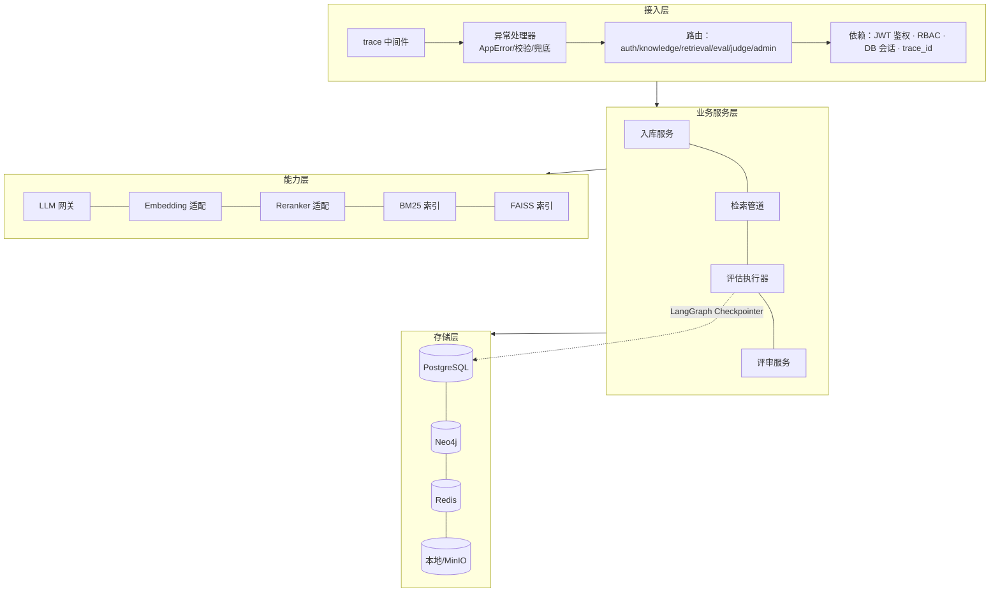
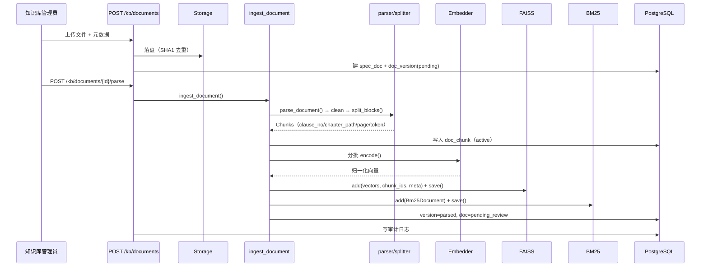
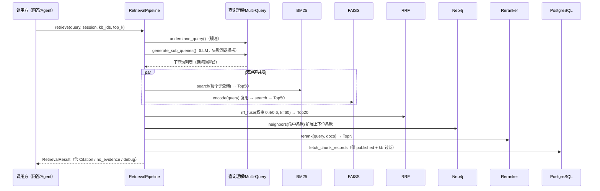
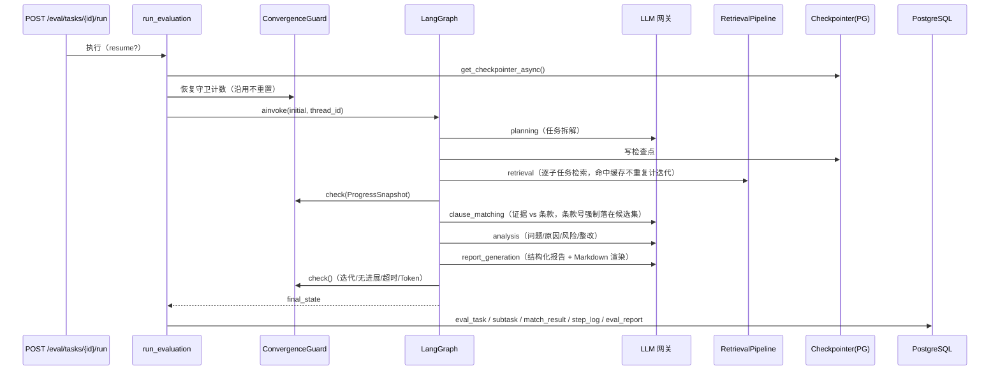
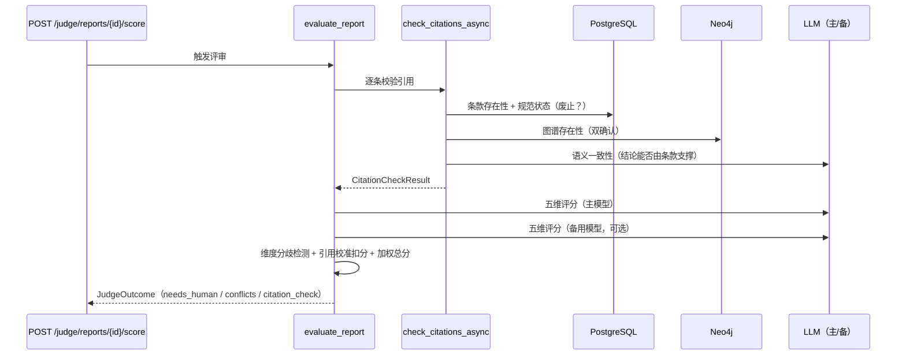
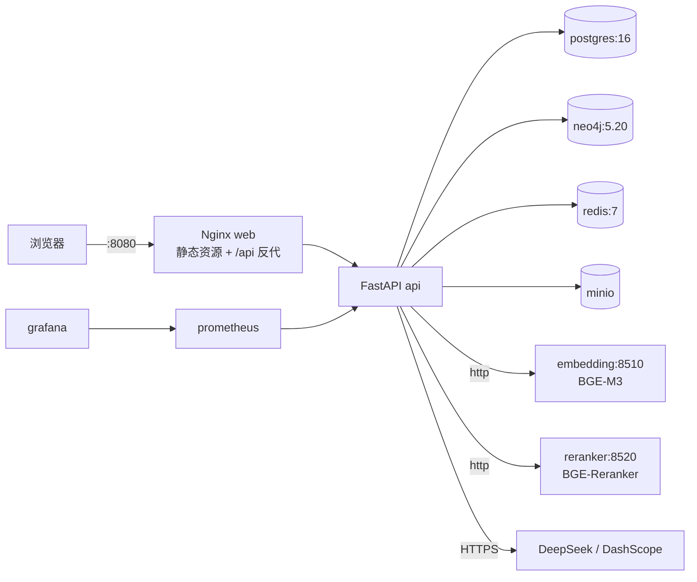

# 工程监理质量智能评估系统 — 概要设计说明书（HLD）

| 项目 | 内容 |
| --- | --- |
| 文档版本 | V1.0 |
| 关联需求 | [《工程监理质量智能评估系统 软件需求规格说明书》V1.0](工程监理质量智能评估系统-需求规格说明书SRS.md) |
| 代码基线 | `supervision-qc/`（后端 73 文件 / 测试 7 文件 / 前端 21 文件） |
| 验证状态 | pytest 90 通过；浏览器端到端 23 项通过；HTTP 联调 24 项通过 |

---

## 1. 设计目标与约束

| 目标 | 设计手段 |
| --- | --- |
| 可解释（C2） | 检索结果强制携带 `Citation`（规范编号/条款号/章节/页码/chunk_id）；Agent 输出与报告均绑定 citation |
| 不臆造（C3） | 判定用的条款号必须来自候选集（模型给的条款号不在候选内则回退重排首条）；重排分数低于阈值返回 `no_evidence`；Judge 做引用存在性校验 |
| 可复现（C4） | 结论口径由比对结果**确定性推导**（不由模型自述）；Embedding 降级为确定性哈希；LLM 温度默认 0.1，Judge 用 0.0 |
| 可降级 | 每个外部依赖（LLM/Embedding/Reranker/Neo4j/检查点）都有降级路径，且降级状态在 `/health`、响应体、日志中显式标注 |
| 不外泄 | 私有化部署，数据层与模型服务同网段；云端模型调用可切本地 Qwen（统一网关） |

---

## 2. 分层架构与依赖方向

**依赖方向单向向下**：路由不直接访问驱动层；能力层不感知业务概念（Embedding 只认文本）；
存储层通过 `session_scope()` 事务上下文统一管理。

---

## 3. 模块设计

### 3.1 模块清单与职责

| 模块 | 关键类/函数 | 职责 | 对应需求 |
| --- | --- | --- | --- |
| `app.core` | `AppError` 体系、`Envelope`、`SafeLogger`、`security` | 横切关注点：统一错误码、响应体、结构化日志、JWT/RBAC | FR-SYS-02/03、6.4 |
| `app.db` | `Base` + 18 张表、`session_scope`、`paginate_query` | 持久化与事务 | SRS 5.2 |
| `app.llm` | `LlmGateway`、`extract_json`、`prompts` | 模型调用、重试/故障转移、结构化输出容错、提示词版本化 | FR-SYS-04/05 |
| `app.ingest` | `parse_document`、`split_blocks` | 多格式解析、清洗、条款感知切分 | FR-KB-03/04/05 |
| `app.retrieval` | `RetrievalPipeline`、`rrf_fuse`、`Bm25Index`、`FaissIndex` | 多阶段检索与索引 | FR-RET-01~10 |
| `app.kg` | `GraphStore`、`build_graph_for_doc` | 图谱构建、引用链、冲突检测 | FR-KG-01~08 |
| `app.agent` | `build_agent_graph`、`ConvergenceGuard`、`StateMachine`、`run_evaluation` | 五阶段评估、收敛控制、状态机、落库 | FR-AGT-01~13 |
| `app.judge` | `evaluate_report`、`check_citations` | 五维评分、引用校验、双模型交叉 | FR-JDG-01~07 |
| `app.services` | `ingest_document`、`rebuild_index`、`get_storage` | 可复用的业务编排 | FR-KB-06/10 |
| `frontend/src` | `api/`、`views/`、`stores/` | 管理后台 11 个页面，仅经 `/api/v1` 与后端耦合 | FR-SYS、各模块前台 |

### 3.2 关键设计决策

| 决策 | 备选方案 | 选择理由 |
| --- | --- | --- |
| 多前缀召回 vs 单前缀 | 单前缀（召回不足） | 复杂问题召回率是核心指标，Multi-Query 后按「子查询 × 通道」逐路 RRF，原问题始终保留 |
| 规则化查询理解 vs LLM 理解 | 纯 LLM（延迟高、易失败） | 意图/实体/数值约束用规则即可稳定获得，零延迟零成本；LLM 只用于改写 |
| RRF vs 加权分数融合 | 分数归一化加权（量纲不可比） | BM25 与余弦相似度量纲不同，RRF 只依赖排名，天然鲁棒 |
| 结论确定性推导 vs 模型自述 | 模型自述（会拔高/淡化） | C3 约束要求结论严格由证据推出，改由 `overall_verdict_from_matches()` 推导 |
| 检查点放 ContextVar vs 状态 | 放进 LangGraph 状态（不可序列化） | 状态必须可序列化才能持久化，运行时依赖（session/pipeline/guard）走 ContextVar |
| 引用校验 + Judge 双保险 | 仅 Judge | Judge 会被流畅文字欺骗；存在性校验是硬约束，直接扣分 |

---

## 4. 关键流程时序

### 4.1 规范入库（解析 → 索引）

### 4.2 多阶段检索（FR-RET-01）

### 4.3 评估 Agent 五阶段（FR-AGT-02/08）

**守卫触发路径**：任一节点 `guard.check()` 返回 `stop=True` → 该节点返回 `guard` + `errors`
→ `finalize_node` 依据 `action` 决定终态（`degrade→DEGRADED`、`need_human→NEED_HUMAN`、否则 `FAILED`）。

### 4.4 Judge 评审与引用校验（FR-JDG）

---

## 5. 数据设计要点

### 5.1 表与索引策略

| 表 | 关键索引 | 说明 |
| --- | --- | --- |
| `spec_doc` | `uq(spec_code, specialty)`、`status`、`specialty` | 规范唯一性 + 检索可见性过滤 |
| `doc_chunk` | `clause_no`、`faiss_id`、`(doc_id, status)` | 条款反查、向量 ID 映射、按文档取块 |
| `clause_ref` | `(src_clause_id, relation)`、`dst_clause_no` | 引用链双向查询（Neo4j 不可用时的兜底） |
| `eval_task` | `current_state`、`(user_id, created_at)`、`project_id` | 状态看板、我的任务 |
| `match_result` | `task_id`、`verdict` | 报告聚合、不符合项统计 |
| `agent_step_log` | `(task_id, seq)` | 执行轨迹回放 |
| `judge_score` | `report_id`、`dimension` | 维度均分看板 |
| `audit_log` | `(user_id, created_at)`、`action` | 审计检索与合规取证 |

### 5.2 三存储一致性

| 存储 | 内容 | 一致性保障 |
| --- | --- | --- |
| PostgreSQL | 权威数据（文档/分块/任务/报告/评分/审计） | 事务提交；`doc_chunk.faiss_id` 记录索引 ID |
| FAISS + BM25 | 派生索引（可分片） | `rebuild_index()` 全量重建；单文档增量 `_remove_existing()` + `add()`；`discover_namespaces()` 自动发现分片 |
| Neo4j | 派生图谱 | `kg_built` 标记；图谱失败不影响检索（`clause_ref` 兜底） |

**设计原则**：以 PostgreSQL 为唯一事实来源，索引与图谱均可由 `rebuild_index()` / `kg/extract` 重建。

---

## 6. 前端设计

| 关注点 | 设计 |
| --- | --- |
| 工程分离 | `frontend/` 独立 `package.json`/Vite/TS，产物为静态资源；后端不知前端存在 |
| 契约耦合 | `src/api/index.ts` 与 OpenAPI 对齐的类型 + `request<T>()` 解包统一响应体 |
| 鉴权 | Token 存 `localStorage`；响应拦截器遇 401/40101 清凭证并跳登录（携带 redirect） |
| 错误呈现 | `ApiError` 携带 code/message/trace_id；页面统一 `ElMessage` 提示 |
| 状态管理 | Pinia `auth` store 管理用户/角色与权限派生（`canWriteKb` / `canReview`） |
| 路由 | Hash 路由 + `meta.roles` 预留；未登录守卫拦截 |
| 页面 | 登录、总览、知识库、规范详情、图谱、问答、评估列表、任务详情、质量评审、系统审计 |

---

## 7. 部署拓扑

**启动顺序**（`depends_on: service_healthy`）：`postgres/neo4j/redis` → `api` → `web`；
模型服务独立健康检查（含模型加载 start_period 120s）。

**单 worker 说明**：FAISS/BM25 索引驻留进程内存，`--workers 1` 避免多进程索引不一致；
横向扩展时应把向量检索迁移到独立服务（Compose 已预留 `embedding`/`reranker` 形态）。

---

## 8. 横切设计

| 关注点 | 实现 |
| --- | --- |
| trace_id | `trace_middleware` 生成 → `ContextVar` → 日志/响应头/审计表全链路 |
| 异常分层 | `AppError`（业务，带错误码与 HTTP 状态）→ 校验异常 → 兜底 500；三者统一响应体 |
| 日志安全 | `SafeLogger` 把 `extra` 中与 LogRecord 同名的键改名，防止日志导致 500 |
| LLM 可观测 | 每次调用记录模型/Token/耗时/是否降级；`start_usage_session()` 累计到任务级预算 |
| 并发控制 | 检索双通道 `run_in_executor`；LLM 侧 `asyncio.Semaphore(llm_concurrency)` |
| 事件循环 | win32 导入期切 Selector（psycopg 异步要求），已有 Proactor 时降级内存检查点 |

---

## 9. 需求追踪矩阵（节选）

| 需求 | 设计/实现 | 验证 |
| --- | --- | --- |
| FR-KB-03/04 | `ingest/parser.py: parse_pdf/docx/txt/xlsx` + `clean_text` | `test_retrieval.py::test_clean_text_*` |
| FR-KB-05 | `ingest/splitter.py: split_blocks` + `_split_long_line` | `test_splitter_*`（含超长单行） |
| FR-KB-10 | `services/ingest.py: rebuild_index`、`update_chunk` 增量重建 | 集成用例 + `/admin/rebuild-index` |
| FR-RET-03 | `retrieval/query.py: generate_sub_queries`（LLM + 模板回退） | `test_multi_query_falls_back_to_templates_without_llm` |
| FR-RET-04/05 | `bm25.py` / `vector_store.py` / `fusion.py` | `test_bm25_*`、`test_faiss_*`、`test_rrf_*` |
| FR-RET-06 | `retrieval/reranker.py`（Local/Http/ScoreFusion） | 检索自检 + 浏览器问答用例 |
| FR-RET-09 | `retrieval/types.py: Citation` | `test_search_retrieves_temperature_clause`（断言 chunk_id） |
| FR-RET-10 | `pipeline.py` 阈值判定 + `retrieval.py` 兜底文案 | `test_search_reports_no_evidence_for_irrelevant_query` |
| FR-KG-04 | `kg/graph_store.py: reference_chain` | `smoke_graph.py`（5.3.3 → 6.2.1 → 3.0.7） |
| FR-KG-05 | `pipeline.py: _kg_expand` | 检索 `debug.kg_expanded` |
| FR-AGT-02 | `agent/graph.py: build_agent_graph` | `test_eval_task_full_flow`（5 阶段轨迹） |
| FR-AGT-08 | `agent/runner.py` + `AsyncPostgresSaver` | 检查点后端与 `state_snapshot` 断言 |
| FR-AGT-09 | `agent/guards.py` 七机制 | `test_guards.py`（11 个用例） |
| FR-AGT-10 | 各节点异常降级 + `errors` 收集 | 集成用例 + Fake 模式全流程 |
| FR-JDG-03 | `judge/citation.py` + `_calibrate_with_citations` | `test_citation_calibration_*` |
| FR-JDG-04/05 | `_detect_conflicts` / `needs_human` + 任务转 NEED_HUMAN | `test_conflict_detection_*`、`/judge` 用例 |
| FR-SYS-02 | `core/security.py` + `api/deps.py` RBAC | `test_jwt_*`、`test_protected_endpoint_requires_token` |
| FR-SYS-03 | `add_audit_log` | `test_audit_log_records_actions` |

---

## 10. 后续演进建议

| 方向 | 说明 |
| --- | --- |
| 向量检索服务化 | 把 FAISS 与 Embedding 抽为独立服务，支持 API 多副本横向扩展 |
| 队列化评估 | 引入 Celery/RQ 替代 `BackgroundTasks`，支持任务优先级、重试与限流 |
| GraphRAG 深化 | 条款级图嵌入 + 社区摘要，弥补纯条款检索在宏观问题上的不足 |
| 评估集回归 | 建立 300+ 标注问答集，纳入 CI 做 Recall@K / MRR / NDCG 回归门禁 |
| 反馈闭环训练 | 用 `human_feedback` 沉淀的专家修订样本做提示词与重排模型迭代 |
